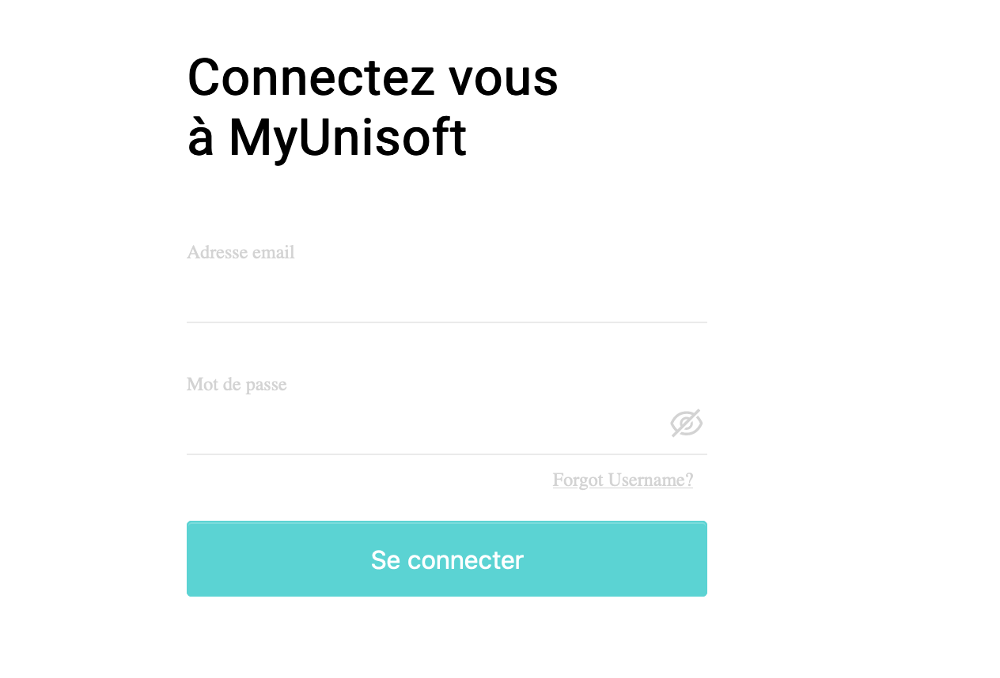
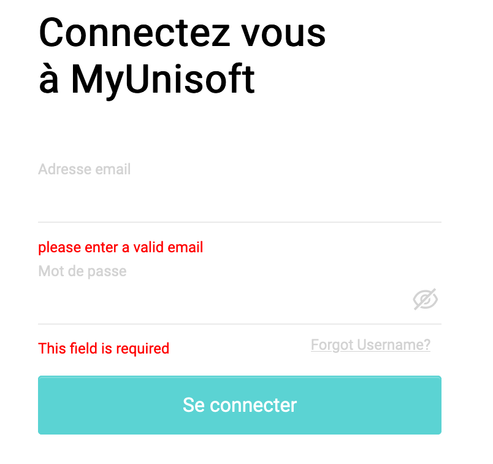
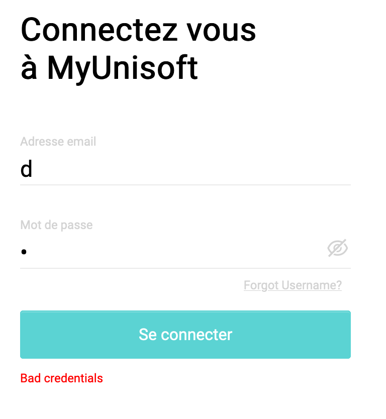
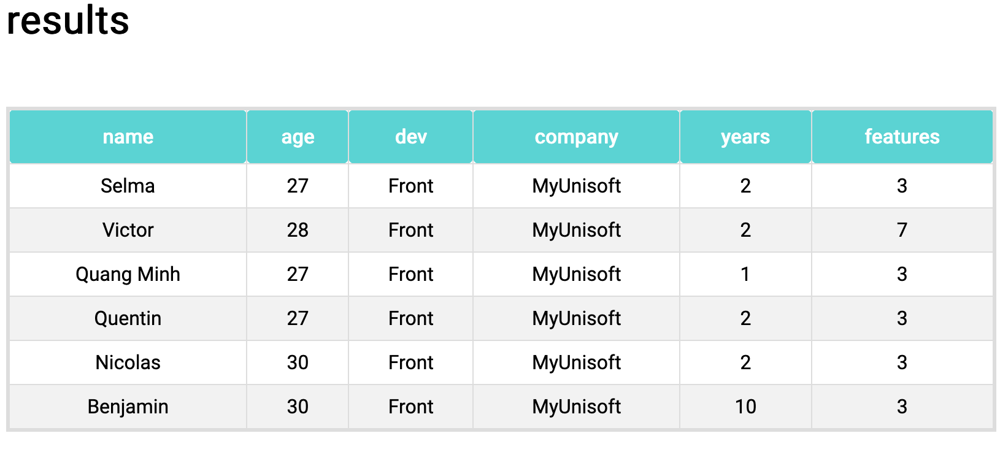

# with Create React App

This project was bootstrapped with [Create React App](https://github.com/facebook/create-react-app).

1. package.json
```
- react-router-dom
- react-hook-form
- react-icons
- typescript
- yup
```

2. To Run

unzip or clone
```
cd ...
yarn install
yarn start
```

### `yarn start`

Runs the app in the development mode.\
Open [http://localhost:3000](http://localhost:3000) to view it in the browser.

The page will reload if you make edits.\
You will also see any lint errors in the console.


### Structure


 ```

├── App.css         //CSS : basic page from create react app modified
├── App.tsx         // initial component with router
├── components
│   ├── Login.tsx   // Login component
│   └── Results.tsx // Table resulst Component
├── index.tsx
├── interfaces
│   └── interfaces.ts // interfaces files
└── utils
    └── utils.ts      // file with function to check login inputs 

 ```





